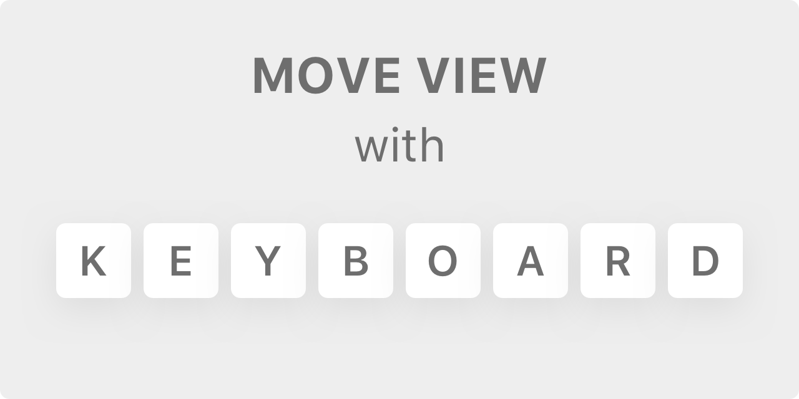
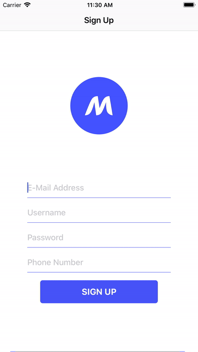

<p align="center">
    
</p>

<p align="center">
    
    
    <a href="https://twitter.com/mflale">
        
    </a>
</p>

<!--# MoveViewwithKeyboard-->

## About

Swift protocol extension for automatically adjusting view offset when keyboard appears/dissapears with only 1 lines of code required for setup propperly.

There is no any pod installation required!

How to use it:
Drag MoveViewwithKeyboard file to you XCode project
In your ViewDidLoad method add "self.setKeyboardMover()"

## Example usage

```swift
class HomeViewController: UIViewController  {

    override func viewDidLoad() {
        super.viewDidLoad()
        
        self.setKeyboardMover()
    }
}
```

## Screenshots

<p align="center">
    
</p>
